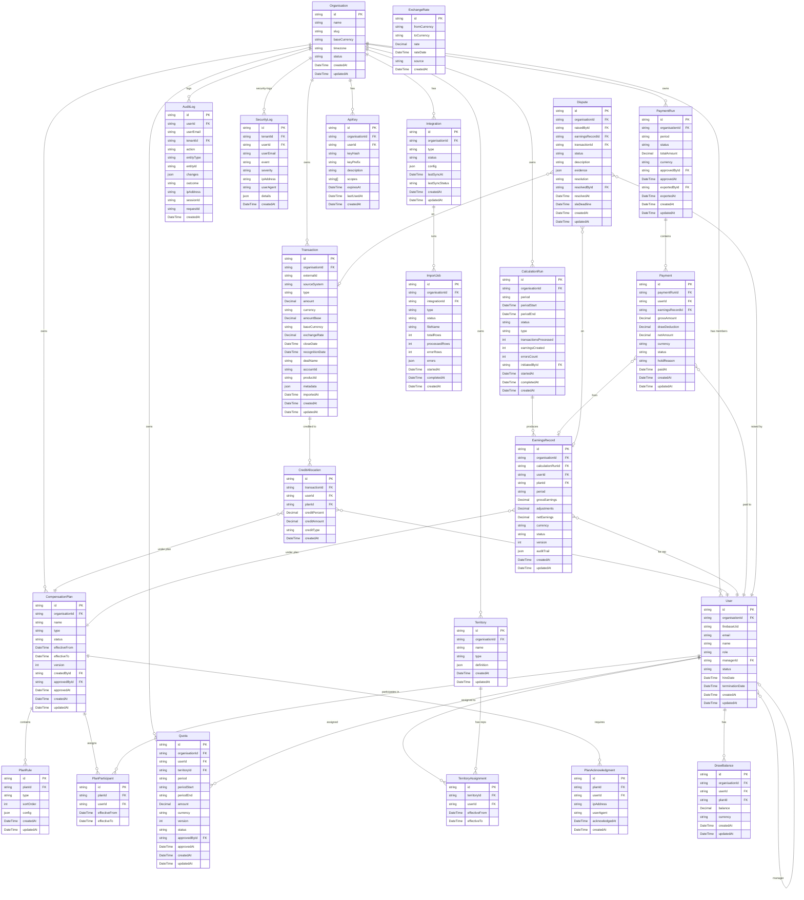

# SmartCommission — Data Model

---

## Schema Overview



---

## Tables

### Organisation

Maps to: `organisations` / Prisma model `Organisation`

| Column | Type | Constraints | Description |
|---|---|---|---|
| `id` | `String` | PK, cuid | Primary key |
| `name` | `String` | NOT NULL | Display name of the organisation |
| `slug` | `String` | UNIQUE, NOT NULL | URL-safe identifier for the org |
| `baseCurrency` | `String` | NOT NULL, default 'USD' | ISO 4217 base currency code (e.g. USD, AUD, GBP) |
| `timezone` | `String` | NOT NULL, default 'UTC' | IANA timezone (e.g. Australia/Sydney) |
| `status` | `String` | NOT NULL, default 'ACTIVE' | ACTIVE / SUSPENDED / CANCELLED |
| `planTier` | `String` | NOT NULL, default 'FREE' | FREE / STARTER / GROWTH / ENTERPRISE |
| `stripeCustomerId` | `String` | NULLABLE | Stripe customer ID for billing |
| `settings` | `Json` | NULLABLE | Org-level settings (JSON blob) |
| `createdAt` | `DateTime` | default now | Creation timestamp |
| `updatedAt` | `DateTime` | auto-updated | Last modification timestamp |

---

### User

Maps to: `users` / Prisma model `User`

| Column | Type | Constraints | Description |
|---|---|---|---|
| `id` | `String` | PK, cuid | Primary key |
| `organisationId` | `String` | FK → Organisation, NOT NULL | Tenant scope |
| `firebaseUid` | `String` | UNIQUE, NULLABLE | Firebase Auth UID (null until first login) |
| `email` | `String` | NOT NULL | User email address |
| `name` | `String` | NOT NULL | Full display name |
| `role` | `String` | NOT NULL, default 'REP' | SUPER_ADMIN / ADMIN / FINANCE / MANAGER / REP / READ_ONLY |
| `managerId` | `String` | FK → User, NULLABLE | Direct manager (for hierarchy rollup) |
| `employeeId` | `String` | NULLABLE | HR system employee ID |
| `department` | `String` | NULLABLE | Department / business unit |
| `jobTitle` | `String` | NULLABLE | Job title |
| `hireDate` | `DateTime` | NULLABLE | Employment start date (for pro-rated quotas) |
| `terminationDate` | `DateTime` | NULLABLE | Employment end date |
| `status` | `String` | NOT NULL, default 'ACTIVE' | ACTIVE / INACTIVE / TERMINATED |
| `mfaEnabled` | `Boolean` | default false | Whether MFA is enabled for this user |
| `lastLoginAt` | `DateTime` | NULLABLE | Last login timestamp |
| `createdAt` | `DateTime` | default now | Creation timestamp |
| `updatedAt` | `DateTime` | auto-updated | Last modification timestamp |

---

### CompensationPlan

Maps to: `compensation_plans` / Prisma model `CompensationPlan`

| Column | Type | Constraints | Description |
|---|---|---|---|
| `id` | `String` | PK, cuid | Primary key |
| `organisationId` | `String` | FK → Organisation, NOT NULL | Tenant scope |
| `name` | `String` | NOT NULL | Plan display name (e.g. "AE New Business FY26") |
| `description` | `String` | NULLABLE | Long-form plan description |
| `type` | `String` | NOT NULL | COMMISSION / BONUS / MBO / SPIF / TEAM / RECOGNITION |
| `status` | `String` | NOT NULL, default 'DRAFT' | DRAFT / REVIEW / APPROVED / PUBLISHED / ARCHIVED |
| `effectiveFrom` | `DateTime` | NOT NULL | Plan start date |
| `effectiveTo` | `DateTime` | NULLABLE | Plan end date (null = open-ended) |
| `currency` | `String` | NOT NULL | Payout currency (ISO 4217) |
| `paymentFrequency` | `String` | NOT NULL, default 'MONTHLY' | DAILY / WEEKLY / BIWEEKLY / SEMI_MONTHLY / MONTHLY / QUARTERLY / ANNUAL |
| `version` | `Int` | NOT NULL, default 1 | Version number, auto-incremented on each change |
| `parentPlanId` | `String` | FK → CompensationPlan, NULLABLE | Links to previous version |
| `isTemplate` | `Boolean` | default false | Whether this plan is a reusable template |
| `templateCategory` | `String` | NULLABLE | AE_NEW_BIZ / AE_EXPANSION / SDR / CSM / CHANNEL / NAMED_ACCOUNT |
| `createdById` | `String` | FK → User, NOT NULL | Who created this plan |
| `approvedById` | `String` | FK → User, NULLABLE | Who approved this plan |
| `approvedAt` | `DateTime` | NULLABLE | Approval timestamp |
| `publishedAt` | `DateTime` | NULLABLE | Publication timestamp |
| `createdAt` | `DateTime` | default now | Creation timestamp |
| `updatedAt` | `DateTime` | auto-updated | Last modification timestamp |

---

### PlanRule

Maps to: `plan_rules` / Prisma model `PlanRule`

| Column | Type | Constraints | Description |
|---|---|---|---|
| `id` | `String` | PK, cuid | Primary key |
| `planId` | `String` | FK → CompensationPlan, NOT NULL | Parent plan |
| `type` | `String` | NOT NULL | FLAT_RATE / TIERED_PROGRESSIVE / TIERED_RETROACTIVE / ACCELERATOR / DECELERATOR / CAP / FLOOR / CLAWBACK / HOLDBACK / DRAW / BONUS_POOL / MBO / SPIF / CUSTOM_FORMULA |
| `name` | `String` | NOT NULL | Human-readable rule name |
| `sortOrder` | `Int` | NOT NULL | Execution order (lower = earlier) |
| `config` | `Json` | NOT NULL | Rule configuration (schema depends on type) |
| `description` | `String` | NULLABLE | Rule documentation for plan reviewers |
| `createdAt` | `DateTime` | default now | Creation timestamp |
| `updatedAt` | `DateTime` | auto-updated | Last modification timestamp |

**`config` examples by rule type:**

*TIERED_PROGRESSIVE:*
```json
{
  "tiers": [
    { "from": 0, "to": 50, "rateType": "PERCENT", "rate": 0 },
    { "from": 50, "to": 100, "rateType": "PERCENT", "rate": 5 },
    { "from": 100, "to": 125, "rateType": "PERCENT", "rate": 8 },
    { "from": 125, "to": null, "rateType": "PERCENT", "rate": 12 }
  ],
  "attainmentBasis": "QUOTA_PERCENT",
  "applyTo": "INCREMENTAL"
}
```

*CAP:*
```json
{
  "capType": "ABSOLUTE",
  "capAmount": 50000,
  "currency": "AUD",
  "period": "MONTHLY",
  "enforcement": "HARD"
}
```

*CLAWBACK:*
```json
{
  "triggerType": "CUSTOMER_CANCEL",
  "lookbackMonths": 6,
  "recoveryType": "PRORATED",
  "prorationBasis": "REMAINING_CONTRACT"
}
```

---

### PlanParticipant

Maps to: `plan_participants` / Prisma model `PlanParticipant`

| Column | Type | Constraints | Description |
|---|---|---|---|
| `id` | `String` | PK, cuid | Primary key |
| `planId` | `String` | FK → CompensationPlan, NOT NULL | Plan being assigned |
| `userId` | `String` | FK → User, NOT NULL | Rep or participant |
| `effectiveFrom` | `DateTime` | NOT NULL | When this assignment starts |
| `effectiveTo` | `DateTime` | NULLABLE | When this assignment ends |
| `oteBase` | `Decimal` | NULLABLE | On-target earnings base for this participant |
| `oteCommission` | `Decimal` | NULLABLE | Target commission component at 100% attainment |
| `createdAt` | `DateTime` | default now | Creation timestamp |

---

### Quota

Maps to: `quotas` / Prisma model `Quota`

| Column | Type | Constraints | Description |
|---|---|---|---|
| `id` | `String` | PK, cuid | Primary key |
| `organisationId` | `String` | FK → Organisation, NOT NULL | Tenant scope |
| `userId` | `String` | FK → User, NULLABLE | Rep (null for territory-level quotas) |
| `territoryId` | `String` | FK → Territory, NULLABLE | Territory (null for individual quotas) |
| `planId` | `String` | FK → CompensationPlan, NULLABLE | Plan this quota is linked to |
| `period` | `String` | NOT NULL | Period label (e.g. '2026-Q1', '2026-06') |
| `periodStart` | `DateTime` | NOT NULL | Period start date |
| `periodEnd` | `DateTime` | NOT NULL | Period end date |
| `amount` | `Decimal` | NOT NULL | Quota amount |
| `currency` | `String` | NOT NULL | ISO 4217 currency |
| `type` | `String` | NOT NULL, default 'REVENUE' | REVENUE / UNITS / ACTIVITIES / WEIGHTED |
| `version` | `Int` | NOT NULL, default 1 | Version number |
| `status` | `String` | NOT NULL, default 'DRAFT' | DRAFT / APPROVED / ACTIVE / SUPERSEDED |
| `reason` | `String` | NULLABLE | Reason for this quota (new hire, reorg, etc.) |
| `approvedById` | `String` | FK → User, NULLABLE | Approver |
| `approvedAt` | `DateTime` | NULLABLE | Approval timestamp |
| `createdAt` | `DateTime` | default now | Creation timestamp |
| `updatedAt` | `DateTime` | auto-updated | Last modification timestamp |

---

### Territory

Maps to: `territories` / Prisma model `Territory`

| Column | Type | Constraints | Description |
|---|---|---|---|
| `id` | `String` | PK, cuid | Primary key |
| `organisationId` | `String` | FK → Organisation, NOT NULL | Tenant scope |
| `name` | `String` | NOT NULL | Territory display name |
| `type` | `String` | NOT NULL | GEOGRAPHIC / NAMED_ACCOUNT / INDUSTRY / PRODUCT / CUSTOM |
| `definition` | `Json` | NOT NULL | Territory definition (varies by type: country codes, account ID list, industry codes, etc.) |
| `parentTerritoryId` | `String` | FK → Territory, NULLABLE | Parent in territory hierarchy |
| `createdAt` | `DateTime` | default now | Creation timestamp |
| `updatedAt` | `DateTime` | auto-updated | Last modification timestamp |

---

### TerritoryAssignment

Maps to: `territory_assignments` / Prisma model `TerritoryAssignment`

| Column | Type | Constraints | Description |
|---|---|---|---|
| `id` | `String` | PK, cuid | Primary key |
| `territoryId` | `String` | FK → Territory, NOT NULL | Territory being assigned |
| `userId` | `String` | FK → User, NOT NULL | Rep assigned to territory |
| `role` | `String` | NOT NULL, default 'PRIMARY' | PRIMARY / OVERLAY / BACKUP |
| `effectiveFrom` | `DateTime` | NOT NULL | Assignment start date |
| `effectiveTo` | `DateTime` | NULLABLE | Assignment end date |
| `createdAt` | `DateTime` | default now | Creation timestamp |

---

### Transaction

Maps to: `transactions` / Prisma model `Transaction`

| Column | Type | Constraints | Description |
|---|---|---|---|
| `id` | `String` | PK, cuid | Primary key |
| `organisationId` | `String` | FK → Organisation, NOT NULL | Tenant scope |
| `externalId` | `String` | NULLABLE | ID from source system (Salesforce Opportunity ID, etc.) |
| `sourceSystem` | `String` | NULLABLE | SALESFORCE / HUBSPOT / PIPEDRIVE / NETSUITE / CSV / API / MANUAL |
| `type` | `String` | NOT NULL, default 'CLOSED_WON' | CLOSED_WON / RENEWAL / EXPANSION / CHURN / ADJUSTMENT / SPIF_TRIGGER |
| `amount` | `Decimal` | NOT NULL | Transaction amount in original currency |
| `currency` | `String` | NOT NULL | ISO 4217 original currency |
| `amountBase` | `Decimal` | NOT NULL | Amount converted to org base currency |
| `baseCurrency` | `String` | NOT NULL | Org base currency at time of transaction |
| `exchangeRate` | `Decimal` | NOT NULL, default 1 | Rate used for conversion |
| `exchangeRateDate` | `DateTime` | NULLABLE | Date of exchange rate used |
| `closeDate` | `DateTime` | NOT NULL | Deal close / revenue recognition date |
| `recognitionDate` | `DateTime` | NULLABLE | For ASC 606: actual revenue recognition date |
| `dealName` | `String` | NULLABLE | CRM opportunity name |
| `accountId` | `String` | NULLABLE | CRM account ID |
| `accountName` | `String` | NULLABLE | Account/company name |
| `productId` | `String` | NULLABLE | Product/SKU ID |
| `productName` | `String` | NULLABLE | Product display name |
| `contractLength` | `Int` | NULLABLE | Contract length in months (for ARR/MRR calculations) |
| `isRecurring` | `Boolean` | default false | Whether this is a recurring revenue transaction |
| `metadata` | `Json` | NULLABLE | Additional fields from source system |
| `status` | `String` | NOT NULL, default 'ACTIVE' | ACTIVE / VOIDED / ADJUSTED |
| `voidedAt` | `DateTime` | NULLABLE | When the transaction was voided |
| `voidReason` | `String` | NULLABLE | Why it was voided |
| `importJobId` | `String` | FK → ImportJob, NULLABLE | Which import created this |
| `createdAt` | `DateTime` | default now | Creation timestamp |
| `updatedAt` | `DateTime` | auto-updated | Last modification timestamp |

---

### CreditAllocation

Maps to: `credit_allocations` / Prisma model `CreditAllocation`

| Column | Type | Constraints | Description |
|---|---|---|---|
| `id` | `String` | PK, cuid | Primary key |
| `transactionId` | `String` | FK → Transaction, NOT NULL | Source transaction |
| `userId` | `String` | FK → User, NOT NULL | Rep receiving credit |
| `planId` | `String` | FK → CompensationPlan, NOT NULL | Plan under which credit is applied |
| `creditPercent` | `Decimal` | NOT NULL | Percentage of the transaction credited (0–100, or >100 for full-credit splits) |
| `creditAmount` | `Decimal` | NOT NULL | Absolute credit amount (creditPercent × transaction amount) |
| `creditType` | `String` | NOT NULL, default 'PRIMARY' | PRIMARY / OVERLAY / SPLIT / TEAM |
| `splitGroupId` | `String` | NULLABLE | Groups allocations that belong to the same split definition |
| `createdAt` | `DateTime` | default now | Creation timestamp |

---

### CalculationRun

Maps to: `calculation_runs` / Prisma model `CalculationRun`

| Column | Type | Constraints | Description |
|---|---|---|---|
| `id` | `String` | PK, cuid | Primary key |
| `organisationId` | `String` | FK → Organisation, NOT NULL | Tenant scope |
| `period` | `String` | NOT NULL | Period label (e.g. '2026-06') |
| `periodStart` | `DateTime` | NOT NULL | Period start date |
| `periodEnd` | `DateTime` | NOT NULL | Period end date |
| `status` | `String` | NOT NULL, default 'PENDING' | PENDING / RUNNING / COMPLETED / FAILED / CANCELLED |
| `type` | `String` | NOT NULL, default 'SCHEDULED' | SCHEDULED / MANUAL / DELTA / RETROACTIVE |
| `transactionsProcessed` | `Int` | default 0 | Number of transactions included |
| `earningsCreated` | `Int` | default 0 | Number of earnings records produced |
| `errorsCount` | `Int` | default 0 | Number of processing errors |
| `errorDetails` | `Json` | NULLABLE | Structured error list |
| `initiatedById` | `String` | FK → User, NULLABLE | Who triggered a manual run |
| `engineVersion` | `String` | NULLABLE | Calculation engine version used |
| `startedAt` | `DateTime` | NULLABLE | When processing began |
| `completedAt` | `DateTime` | NULLABLE | When processing ended |
| `durationMs` | `Int` | NULLABLE | Total processing time in milliseconds |
| `createdAt` | `DateTime` | default now | Creation timestamp |

---

### EarningsRecord

Maps to: `earnings_records` / Prisma model `EarningsRecord`

| Column | Type | Constraints | Description |
|---|---|---|---|
| `id` | `String` | PK, cuid | Primary key |
| `organisationId` | `String` | FK → Organisation, NOT NULL | Tenant scope |
| `calculationRunId` | `String` | FK → CalculationRun, NOT NULL | Calculation run that produced this record |
| `userId` | `String` | FK → User, NOT NULL | Rep |
| `planId` | `String` | FK → CompensationPlan, NOT NULL | Plan |
| `period` | `String` | NOT NULL | Period label |
| `periodStart` | `DateTime` | NOT NULL | Period start date |
| `periodEnd` | `DateTime` | NOT NULL | Period end date |
| `quotaAmount` | `Decimal` | NULLABLE | Quota for this period (snapshot at calculation time) |
| `actualAmount` | `Decimal` | NULLABLE | Actual credited revenue for this period |
| `attainmentPct` | `Decimal` | NULLABLE | Attainment % (actualAmount / quotaAmount × 100) |
| `grossEarnings` | `Decimal` | NOT NULL | Gross commission before adjustments |
| `adjustments` | `Decimal` | default 0 | Total adjustments (positive or negative) |
| `clawbackAmount` | `Decimal` | default 0 | Clawback deductions |
| `holdbackAmount` | `Decimal` | default 0 | Amount held back (pending milestone) |
| `netEarnings` | `Decimal` | NOT NULL | Final net earnings (gross + adjustments - clawbacks - holdbacks) |
| `currency` | `String` | NOT NULL | ISO 4217 payout currency |
| `status` | `String` | NOT NULL, default 'DRAFT' | DRAFT / APPROVED / PAID / DISPUTED / ADJUSTED |
| `version` | `Int` | NOT NULL, default 1 | Version (incremented on retroactive adjustment) |
| `isRetroactive` | `Boolean` | default false | Whether this is a retroactive recalculation |
| `parentEarningsId` | `String` | FK → EarningsRecord, NULLABLE | Points to original record this supersedes |
| `auditTrail` | `Json` | NOT NULL | Step-by-step calculation trace |
| `createdAt` | `DateTime` | default now | Creation timestamp |
| `updatedAt` | `DateTime` | auto-updated | Last modification timestamp |

---

### PaymentRun

Maps to: `payment_runs` / Prisma model `PaymentRun`

| Column | Type | Constraints | Description |
|---|---|---|---|
| `id` | `String` | PK, cuid | Primary key |
| `organisationId` | `String` | FK → Organisation, NOT NULL | Tenant scope |
| `period` | `String` | NOT NULL | Period label |
| `name` | `String` | NOT NULL | Display name (e.g. "June 2026 Commission Run") |
| `status` | `String` | NOT NULL, default 'DRAFT' | DRAFT / APPROVED / EXPORTED / PAID / CANCELLED |
| `totalAmount` | `Decimal` | NOT NULL | Total payment amount |
| `currency` | `String` | NOT NULL | ISO 4217 payout currency |
| `paymentDate` | `DateTime` | NULLABLE | Target payment date |
| `approvedById` | `String` | FK → User, NULLABLE | Finance approver |
| `approvedAt` | `DateTime` | NULLABLE | Approval timestamp |
| `exportFormat` | `String` | NULLABLE | ADP / WORKDAY / MYOB / XERO / CSV |
| `exportedById` | `String` | FK → User, NULLABLE | Who exported to payroll |
| `exportedAt` | `DateTime` | NULLABLE | Export timestamp |
| `notes` | `String` | NULLABLE | Finance notes |
| `createdAt` | `DateTime` | default now | Creation timestamp |
| `updatedAt` | `DateTime` | auto-updated | Last modification timestamp |

---

### Payment

Maps to: `payments` / Prisma model `Payment`

| Column | Type | Constraints | Description |
|---|---|---|---|
| `id` | `String` | PK, cuid | Primary key |
| `paymentRunId` | `String` | FK → PaymentRun, NOT NULL | Parent payment run |
| `userId` | `String` | FK → User, NOT NULL | Rep being paid |
| `earningsRecordId` | `String` | FK → EarningsRecord, NULLABLE | Linked earnings record |
| `grossAmount` | `Decimal` | NOT NULL | Gross commission amount |
| `drawDeduction` | `Decimal` | default 0 | Draw recovery deducted |
| `manualAdjustments` | `Decimal` | default 0 | One-off manual adjustments |
| `netAmount` | `Decimal` | NOT NULL | Net payment amount (gross - deductions + adjustments) |
| `currency` | `String` | NOT NULL | ISO 4217 payout currency |
| `status` | `String` | NOT NULL, default 'PENDING' | PENDING / HELD / APPROVED / PAID / CANCELLED |
| `holdReason` | `String` | NULLABLE | Why the payment is on hold |
| `heldById` | `String` | FK → User, NULLABLE | Who placed the hold |
| `heldAt` | `DateTime` | NULLABLE | When the hold was placed |
| `paidAt` | `DateTime` | NULLABLE | When confirmed as paid |
| `payrollReference` | `String` | NULLABLE | Reference number from payroll system |
| `createdAt` | `DateTime` | default now | Creation timestamp |
| `updatedAt` | `DateTime` | auto-updated | Last modification timestamp |

---

### Dispute

Maps to: `disputes` / Prisma model `Dispute`

| Column | Type | Constraints | Description |
|---|---|---|---|
| `id` | `String` | PK, cuid | Primary key |
| `organisationId` | `String` | FK → Organisation, NOT NULL | Tenant scope |
| `referenceNumber` | `String` | UNIQUE, NOT NULL | Human-readable reference (e.g. DIS-2026-0042) |
| `raisedById` | `String` | FK → User, NOT NULL | Rep who raised the dispute |
| `earningsRecordId` | `String` | FK → EarningsRecord, NULLABLE | Earnings record in dispute |
| `transactionId` | `String` | FK → Transaction, NULLABLE | Specific transaction in dispute |
| `period` | `String` | NOT NULL | Affected period |
| `status` | `String` | NOT NULL, default 'OPEN' | OPEN / MANAGER_REVIEW / FINANCE_REVIEW / RESOLVED / CLOSED |
| `category` | `String` | NOT NULL | MISSING_TRANSACTION / WRONG_RATE / WRONG_SPLIT / QUOTA_ERROR / CLAWBACK_DISPUTE / OTHER |
| `description` | `String` | NOT NULL | Rep's description of the issue |
| `evidence` | `Json` | NULLABLE | Array of evidence file references and descriptions |
| `managerReviewedById` | `String` | FK → User, NULLABLE | Manager who reviewed |
| `managerReviewedAt` | `DateTime` | NULLABLE | Manager review timestamp |
| `managerNotes` | `String` | NULLABLE | Manager's notes |
| `financeReviewedById` | `String` | FK → User, NULLABLE | Finance reviewer |
| `financeReviewedAt` | `DateTime` | NULLABLE | Finance review timestamp |
| `resolution` | `String` | NULLABLE | APPROVED / DENIED / PARTIAL_APPROVED |
| `resolutionNotes` | `String` | NULLABLE | Resolution details |
| `adjustmentAmount` | `Decimal` | NULLABLE | Adjustment to be made as a result of resolution |
| `resolvedById` | `String` | FK → User, NULLABLE | Who resolved |
| `resolvedAt` | `DateTime` | NULLABLE | Resolution timestamp |
| `slaDeadline` | `DateTime` | NOT NULL | SLA deadline for resolution |
| `createdAt` | `DateTime` | default now | Creation timestamp |
| `updatedAt` | `DateTime` | auto-updated | Last modification timestamp |

---

### AuditLog

Maps to: `audit_logs` / Prisma model `AuditLog`

Field names match the canonical `audit-logging.md` schema and the actual `prisma/schema.prisma`. (D-003 fixed 2026-06-22)

| Column | Type | Constraints | Description |
|---|---|---|---|
| `id` | `String` | PK, cuid | Primary key |
| `userId` | `String` | NULLABLE | User who performed the action (null for system actions) |
| `userEmail` | `String` | NULLABLE | Denormalised email (preserved if user deleted) |
| `sessionId` | `String` | NULLABLE | Session identifier |
| `ipAddress` | `String` | NULLABLE | Client IP address |
| `userAgent` | `String` | NULLABLE | Browser/client user agent |
| `tenantId` | `String` | NULLABLE | Org scope — null for platform-level actions |
| `action` | `String` | NOT NULL | Format `ENTITY.VERB` e.g. `PLAN.PUBLISH`, `PAYMENT.APPROVE`, `TRANSACTION.IMPORT` |
| `entityType` | `String` | NOT NULL | CompensationPlan / Quota / Transaction / EarningsRecord / Payment / Dispute / User / etc. |
| `entityId` | `String` | NULLABLE | ID of the affected entity |
| `changes` | `Json` | NULLABLE | `{ "field": { "old": X, "new": Y } }` diff — sensitive values omitted |
| `metadata` | `Json` | NULLABLE | Extra context (e.g. plan version, period, calculation run ID) |
| `outcome` | `String` | default 'SUCCESS' | `SUCCESS` / `FAILURE` |
| `requestId` | `String` | NULLABLE | HTTP request correlation ID |
| `createdAt` | `DateTime` | default now, NOT NULL | Immutable — never updated |

---

### SecurityLog

Maps to: `security_logs` / Prisma model `SecurityLog`

Required by the CLAUDE.md audit-logging standard. Tracks authentication, authorisation, and permission-change events separately from the general audit log for tamper-evident storage.

| Column | Type | Constraints | Description |
|---|---|---|---|
| `id` | `String` | PK, cuid | Primary key |
| `userId` | `String` | NULLABLE | User involved (null for pre-auth events) |
| `userEmail` | `String` | NULLABLE | Denormalised email (preserved if user deleted) |
| `ipAddress` | `String` | NULLABLE | Client IP address |
| `userAgent` | `String` | NULLABLE | Browser/client user agent |
| `tenantId` | `String` | NULLABLE | Tenant scope (null for platform-level events) |
| `event` | `String` | NOT NULL | `LOGIN_SUCCESS` / `LOGIN_FAILURE` / `LOGOUT` / `SUPERADMIN_GRANTED` / `SUPERADMIN_REVOKED` / `PASSWORD_RESET` / `EMAIL_CHANGED` / `API_KEY_CREATED` / `API_KEY_REVOKED` / `DATA_EXPORTED` / `UNAUTHORIZED_ACCESS` / `PROXY_STARTED` / `PROXY_STOPPED` / `SSO_LOGIN_SUCCESS` / `SSO_LOGIN_FAILURE` / `CONTEXT_SWITCH` |
| `severity` | `String` | NOT NULL, default 'INFO' | `INFO` / `WARNING` / `CRITICAL` |
| `details` | `Json` | NULLABLE | Additional event context (e.g. targetUserId for proxy, reason for superadmin grant) |
| `createdAt` | `DateTime` | default now, NOT NULL | Immutable — never updated |

**Notes:**
- Append-only: no UPDATE or DELETE operations permitted.
- CRITICAL events (SUPERADMIN_GRANTED, SUPERADMIN_REVOKED, IMPERSONATION_STARTED) are additionally written to GCP Cloud Logging (stdout JSON) for tamper-evident storage.
- Retention: 3 years minimum. On account deletion: set userId null, userEmail '[deleted]' — never hard-delete.
- Index on `(organisationId, createdAt)` for time-range queries.
- Index on `(event, severity)` for security dashboard queries.

---

### Integration

Maps to: `integrations` / Prisma model `Integration`

| Column | Type | Constraints | Description |
|---|---|---|---|
| `id` | `String` | PK, cuid | Primary key |
| `organisationId` | `String` | FK → Organisation, NOT NULL | Tenant scope |
| `type` | `String` | NOT NULL | SALESFORCE / HUBSPOT / PIPEDRIVE / DYNAMICS / NETSUITE / XERO / QUICKBOOKS / WORKDAY / BAMBOOHR / ADP / WEBHOOK |
| `name` | `String` | NOT NULL | User-defined connection name |
| `status` | `String` | NOT NULL, default 'INACTIVE' | INACTIVE / ACTIVE / ERROR / PAUSED |
| `config` | `Json` | NOT NULL | Encrypted connection config (instance URL, credentials reference, field mappings) |
| `syncSchedule` | `String` | NULLABLE | Cron expression for scheduled sync |
| `syncDirection` | `String` | NOT NULL, default 'INBOUND' | INBOUND / OUTBOUND / BIDIRECTIONAL |
| `lastSyncAt` | `DateTime` | NULLABLE | Last successful sync timestamp |
| `lastSyncStatus` | `String` | NULLABLE | SUCCESS / PARTIAL / FAILED |
| `lastSyncStats` | `Json` | NULLABLE | Records synced, errors, duration |
| `createdAt` | `DateTime` | default now | Creation timestamp |
| `updatedAt` | `DateTime` | auto-updated | Last modification timestamp |

---

### ImportJob

Maps to: `import_jobs` / Prisma model `ImportJob`

| Column | Type | Constraints | Description |
|---|---|---|---|
| `id` | `String` | PK, cuid | Primary key |
| `organisationId` | `String` | FK → Organisation, NOT NULL | Tenant scope |
| `integrationId` | `String` | FK → Integration, NULLABLE | If triggered by an integration sync |
| `type` | `String` | NOT NULL | TRANSACTIONS / QUOTAS / USERS / TERRITORIES / HISTORICAL |
| `status` | `String` | NOT NULL, default 'PENDING' | PENDING / RUNNING / COMPLETED / COMPLETED_WITH_ERRORS / FAILED |
| `fileName` | `String` | NULLABLE | Original file name (for CSV imports) |
| `fileStoragePath` | `String` | NULLABLE | Cloud Storage path of the raw file |
| `totalRows` | `Int` | default 0 | Total rows in the input |
| `processedRows` | `Int` | default 0 | Rows successfully processed |
| `errorRows` | `Int` | default 0 | Rows that failed validation |
| `errors` | `Json` | NULLABLE | Structured error list: [{row, field, error}] |
| `onDuplicate` | `String` | NOT NULL, default 'SKIP' | SKIP / UPDATE / ERROR |
| `initiatedById` | `String` | FK → User, NULLABLE | Who triggered the import |
| `startedAt` | `DateTime` | NULLABLE | Processing start time |
| `completedAt` | `DateTime` | NULLABLE | Processing end time |
| `createdAt` | `DateTime` | default now | Creation timestamp |

---

### ApiKey

Maps to: `api_keys` / Prisma model `ApiKey`

| Column | Type | Constraints | Description |
|---|---|---|---|
| `id` | `String` | PK, cuid | Primary key |
| `organisationId` | `String` | FK → Organisation, NOT NULL | Tenant scope |
| `userId` | `String` | FK → User, NOT NULL | Key owner |
| `keyHash` | `String` | UNIQUE, NOT NULL | SHA-256 hash of the full key (never stored plain) |
| `keyPrefix` | `String` | NOT NULL | First 8 chars of key for display (e.g. `sc_live_ab`) |
| `description` | `String` | NULLABLE | User-defined label |
| `scopes` | `String[]` | NOT NULL | Array: read / write / admin / webhooks |
| `environment` | `String` | NOT NULL, default 'PRODUCTION' | PRODUCTION / SANDBOX |
| `expiresAt` | `DateTime` | NULLABLE | Optional expiry |
| `lastUsedAt` | `DateTime` | NULLABLE | Last API call timestamp |
| `revokedAt` | `DateTime` | NULLABLE | If revoked |
| `createdAt` | `DateTime` | default now | Creation timestamp |

---

### ExchangeRate

Maps to: `exchange_rates` / Prisma model `ExchangeRate`

| Column | Type | Constraints | Description |
|---|---|---|---|
| `id` | `String` | PK, cuid | Primary key |
| `fromCurrency` | `String` | NOT NULL | Source currency ISO 4217 |
| `toCurrency` | `String` | NOT NULL | Target currency ISO 4217 |
| `rate` | `Decimal` | NOT NULL | Conversion rate (1 unit of fromCurrency = rate units of toCurrency) |
| `rateDate` | `DateTime` | NOT NULL | Date the rate is valid for |
| `source` | `String` | NOT NULL | XE / OPEN_EXCHANGE / MANUAL |
| `createdAt` | `DateTime` | default now | Creation timestamp |

---

### PlanAcknowledgment

Maps to: `plan_acknowledgments` / Prisma model `PlanAcknowledgment`

| Column | Type | Constraints | Description |
|---|---|---|---|
| `id` | `String` | PK, cuid | Primary key |
| `planId` | `String` | FK → CompensationPlan, NOT NULL | Plan being acknowledged |
| `userId` | `String` | FK → User, NOT NULL | Rep signing |
| `ipAddress` | `String` | NOT NULL | IP address at time of signing |
| `userAgent` | `String` | NOT NULL | Browser user agent |
| `deviceFingerprint` | `String` | NULLABLE | Device fingerprint hash |
| `acknowledgedAt` | `DateTime` | NOT NULL | Exact timestamp of e-signature (ISO 8601 UTC) |
| `createdAt` | `DateTime` | default now | Creation timestamp |

---

### DrawBalance

Maps to: `draw_balances` / Prisma model `DrawBalance`

| Column | Type | Constraints | Description |
|---|---|---|---|
| `id` | `String` | PK, cuid | Primary key |
| `organisationId` | `String` | FK → Organisation, NOT NULL | Tenant scope |
| `userId` | `String` | FK → User, NOT NULL | Rep |
| `planId` | `String` | FK → CompensationPlan, NOT NULL | Plan under which draw is tracked |
| `balance` | `Decimal` | NOT NULL, default 0 | Outstanding draw balance (positive = rep owes; negative = overpaid draw) |
| `currency` | `String` | NOT NULL | ISO 4217 currency |
| `isRecoverable` | `Boolean` | NOT NULL, default true | Whether the balance is recoverable from future earnings |
| `createdAt` | `DateTime` | default now | Creation timestamp |
| `updatedAt` | `DateTime` | auto-updated | Last modification timestamp |

---

## Enums

### UserRole

| Value | Meaning |
|---|---|
| `SUPER_ADMIN` | SmartCommission platform operator. Cross-org visibility. Internal use only. |
| `ADMIN` | Organisation administrator. Full access within their org. |
| `FINANCE` | Finance team. Can approve payment runs, view all earnings, manage clawbacks. Cannot edit plans. |
| `MANAGER` | Sales manager. Can view direct reports' earnings and attainment. Cannot edit plans or approve payments. |
| `REP` | Sales representative. Can view their own earnings, disputes, and plan documents only. |
| `READ_ONLY` | View-only access to earnings and reports. Used for auditors and executives. |

### PlanType

| Value | Meaning |
|---|---|
| `COMMISSION` | Standard commission plan (percentage or flat rate per deal) |
| `BONUS` | Lump-sum bonus (period-end, not per-deal) |
| `MBO` | Management by Objectives — weighted goal scoring |
| `SPIF` | Short-term performance incentive fund — fixed reward on trigger |
| `TEAM` | Team-based incentive — group attainment drives individual payout |
| `RECOGNITION` | Non-cash recognition awards |

### PlanStatus

| Value | Meaning |
|---|---|
| `DRAFT` | Being built; not visible to participants |
| `REVIEW` | Submitted for approval |
| `APPROVED` | Approved; ready to publish |
| `PUBLISHED` | Live; participants can view and acknowledge |
| `ARCHIVED` | No longer active; kept for historical reference |

### TransactionType

| Value | Meaning |
|---|---|
| `CLOSED_WON` | New business closed |
| `RENEWAL` | Contract renewal |
| `EXPANSION` | Upsell or expansion revenue |
| `CHURN` | Customer cancellation (may trigger clawback) |
| `ADJUSTMENT` | Manual correction to a prior transaction |
| `SPIF_TRIGGER` | Event that triggers a SPIF payout |

### DisputeStatus

| Value | Meaning |
|---|---|
| `OPEN` | Newly submitted by rep |
| `MANAGER_REVIEW` | Assigned to manager for review |
| `FINANCE_REVIEW` | Escalated to Finance |
| `RESOLVED` | Resolution provided |
| `CLOSED` | Acknowledged by rep; no further action |

### DisputeResolution

| Value | Meaning |
|---|---|
| `APPROVED` | Rep's claim upheld; adjustment issued |
| `DENIED` | Rep's claim rejected; no change |
| `PARTIAL_APPROVED` | Partial adjustment issued |

---

## Indexes

| Table | Columns | Type | Purpose |
|---|---|---|---|
| `users` | `organisationId, email` | Unique | Ensure email uniqueness per org |
| `users` | `firebaseUid` | Unique | Firebase Auth lookup |
| `users` | `organisationId, managerId` | B-tree | Hierarchy traversal |
| `compensation_plans` | `organisationId, status` | B-tree | Filter published plans for an org |
| `compensation_plans` | `organisationId, effectiveFrom, effectiveTo` | B-tree | Date-range queries |
| `quotas` | `organisationId, userId, period` | B-tree | Quota lookup during calculation |
| `quotas` | `organisationId, territoryId, period` | B-tree | Territory quota lookup |
| `transactions` | `organisationId, closeDate` | B-tree | Period-range calculation queries |
| `transactions` | `organisationId, externalId, sourceSystem` | Unique | Duplicate detection on import |
| `transactions` | `organisationId, status` | B-tree | Filter voided transactions |
| `credit_allocations` | `transactionId` | B-tree | Find all allocations for a transaction |
| `credit_allocations` | `userId, planId` | B-tree | Find all allocations for a rep under a plan |
| `earnings_records` | `organisationId, userId, period` | B-tree | Rep portal earnings lookup |
| `earnings_records` | `calculationRunId` | B-tree | All earnings for a calculation run |
| `earnings_records` | `organisationId, period, status` | B-tree | Finance payment run queries |
| `payments` | `paymentRunId` | B-tree | All payments in a run |
| `payments` | `userId` | B-tree | Payment history for a rep |
| `disputes` | `organisationId, status` | B-tree | Dispute queue management |
| `disputes` | `raisedById` | B-tree | Rep's own disputes |
| `audit_logs` | `organisationId, createdAt` | B-tree | Chronological audit queries |
| `audit_logs` | `entityType, entityId` | B-tree | Entity-specific audit trail |
| `exchange_rates` | `fromCurrency, toCurrency, rateDate` | Unique | Rate lookup by date |

---

## Relationships

- `Organisation` → `User`: one-to-many — one org has many users; every user belongs to exactly one org
- `Organisation` → `CompensationPlan`: one-to-many — one org owns many plans
- `Organisation` → `Transaction`: one-to-many — all transactions are tenant-scoped
- `User` → `User` (manager): many-to-one self-referential — a user optionally reports to another user in the same org
- `CompensationPlan` → `PlanRule`: one-to-many — a plan has one or more rules executed in order
- `CompensationPlan` → `PlanParticipant`: one-to-many — a plan is assigned to one or more reps with effective dates
- `CompensationPlan` → `CompensationPlan` (versioning): a plan's `parentPlanId` links to its prior version
- `Transaction` → `CreditAllocation`: one-to-many — one deal may be credited to multiple reps
- `CalculationRun` → `EarningsRecord`: one-to-many — a calculation run produces one earnings record per rep per plan
- `EarningsRecord` → `EarningsRecord` (retroactive): `parentEarningsId` links a retroactive recalculation to the original
- `PaymentRun` → `Payment`: one-to-many — one payment run contains one payment per participating rep
- `Payment` → `EarningsRecord`: many-to-one — a payment settles a specific earnings record
- `Dispute` → `EarningsRecord`: many-to-one — a dispute targets a specific earnings record
- `Dispute` → `Transaction`: many-to-one (optional) — a dispute may target a specific transaction within an earnings period

---

## Additional Models

The following models are in `apps/web/prisma/schema.prisma`. (R-092, R-093 resolved 2026-06-22)

### SuperAdmin
**Not used.** SmartCommission uses `User.isSuperAdmin` boolean on the `User` model — no separate SuperAdmin table. See `superuser.md`.

### SsoConfig
Per-organisation SSO configuration. ✅ Implemented 2026-06-20 — model in `apps/web/prisma/schema.prisma`. See `sso.md`. Fields: id, organisationId, protocol (SAML|OIDC), SAML/OIDC IdP fields, SP identity fields, emailDomain, forceSso, isEnabled, isVerified, isIdpEnabled, idpClients, createdById, updatedById, createdAt, updatedAt.

### ApiKey
Per-organisation API keys. ✅ Implemented 2026-06-20 — model in `apps/web/prisma/schema.prisma`. Fields: id, organisationId, name, keyPrefix (unique lookup), keyHash (stored hashed), scopes, lastUsedAt, expiresAt, revokedAt, createdById, createdAt.

### ReleaseNote
Platform and tenant release notes. See `release-notes.md`. ✅ Implemented 2026-06-20 — model in `apps/web/prisma/schema.prisma`. Two streams: PLATFORM and TENANT. Fields: id, version, title, summary, body, type, category, isVisible, isPublished, publishedAt, tenantId, createdById, updatedById, createdAt, updatedAt.

### AiSession / AiMessage
AI assistant conversation history. See `ai-assistant.md`. Planned Phase 4 (R-066).

### SavedQuery / QueryRun
Query console and published reports. See `query-console.md`. ✅ Implemented 2026-06-20 — models in `apps/web/prisma/schema.prisma`. Fields: id, organisationId, name, description, sql, parameters, tags, isPublished, visibility, shareToken, createdById, and all associated `QueryRun` execution records.

---

## Schema Alignment Notes

**D-003 fixed 2026-06-22:** `AuditLog` and `SecurityLog` field names updated in this document to match the canonical `audit-logging.md` schema and the actual `apps/web/prisma/schema.prisma`. Old draft names (`actorId`, `actorEmail`, `actionType`, `oldValue`, `newValue`, `organisationId`, `gcpLogged`) replaced with canonical names (`userId`, `userEmail`, `action`, `changes`, `outcome`, `tenantId`, `details`).
