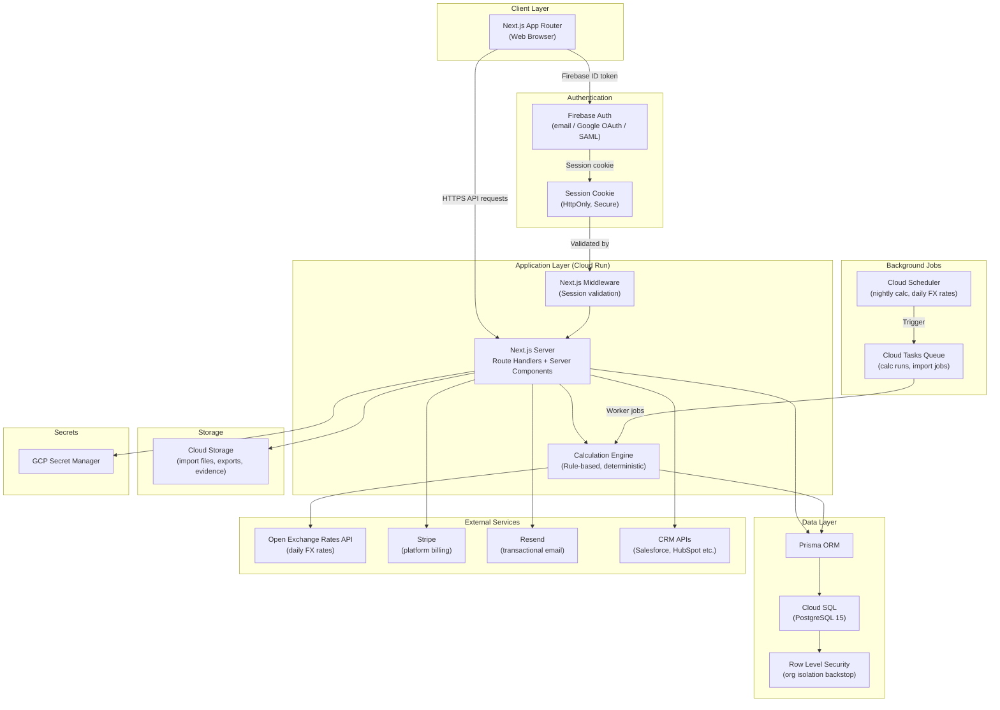
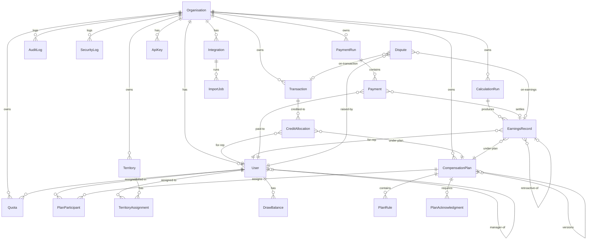
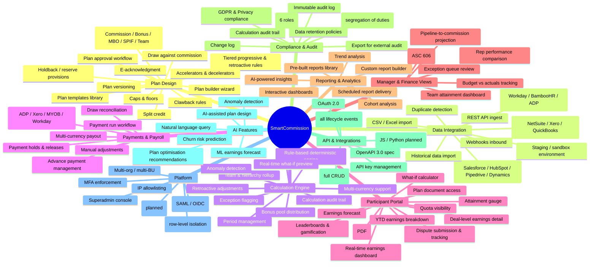
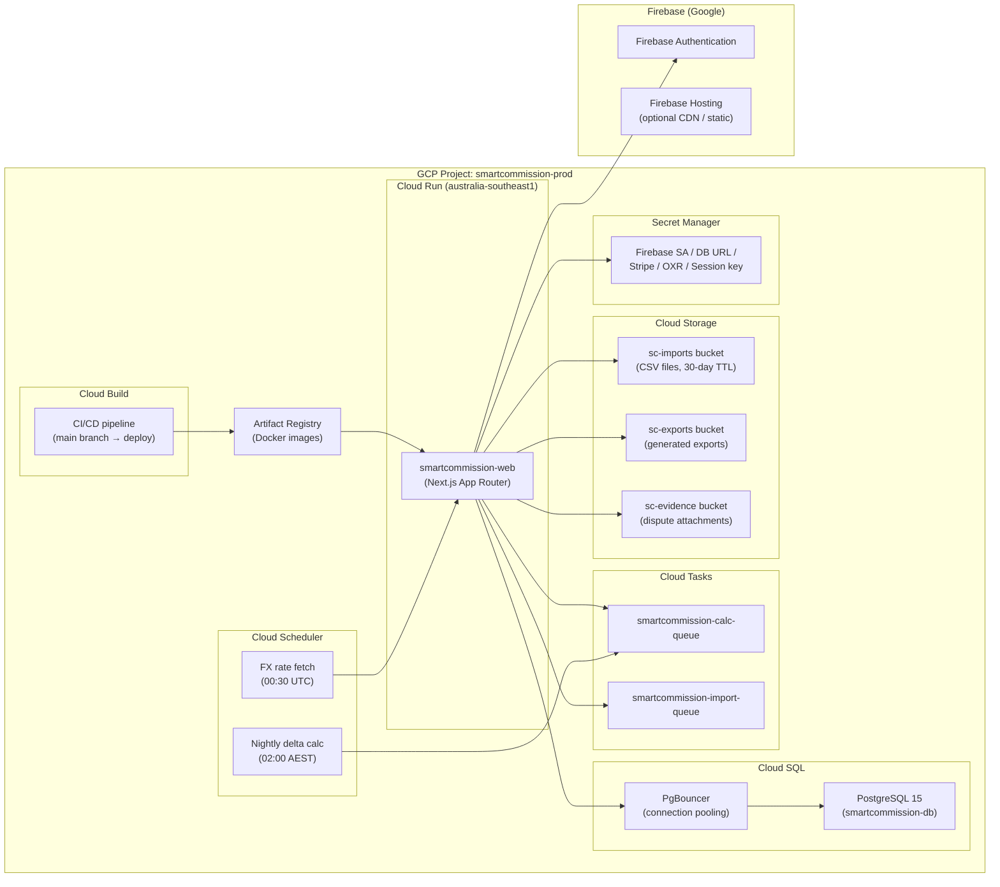
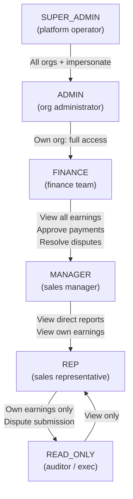

# SmartCommission — Knowledge Graph

Architecture, data model, and feature map for SmartCommission.

---

## System Architecture

---

## Data Model (Entity Relationships)

---

## Feature Map

---

## Deployment Architecture

---

## RBAC Permission Matrix

